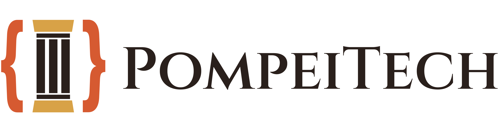

<picture>
  <source media="(prefers-color-scheme: dark)" srcset="assets/pompeitech-logo-dark.png">
  <source media="(prefers-color-scheme: light)" srcset="assets/pompeitech-logo-light.png">
  
</picture>

Diffondiamo competenze informatiche e digitali attraverso formazione tecnica, eventi e attività
educative, con particolare attenzione ai giovani e al territorio.

🌐 [pompeitech.com](https://pompeitech.com) · ✉️ [info@pompeitech.com](mailto:info@pompeitech.com)

---

## In evidenza

- **[Vesuvius UI](https://github.com/pompeitech/vesuvius-ui)** — un component kit React +
  TypeScript costruito su Radix UI e Tailwind CSS v4, pubblicato su npm come
  [`@pompeitech/vesuvius-ui`](https://www.npmjs.com/package/@pompeitech/vesuvius-ui), rilasciato
  in modo incrementale (atomi, poi molecole, poi organismi).

---

Ci trovi anche su [pompeitech.com](https://pompeitech.com) — scrivici a
[info@pompeitech.com](mailto:info@pompeitech.com) per formazione, eventi o collaborazioni.
